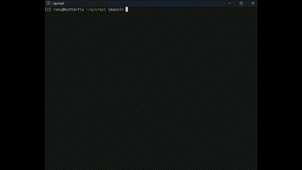

# CREPL - C Read Eval Print Loop


A C interpreter.



## Run

```bash
git clone https://www.github.com/akash1047/crepl.git
cd crepl
cargo run
```

## Exiting repl

repl can't exit, ask simba for help
